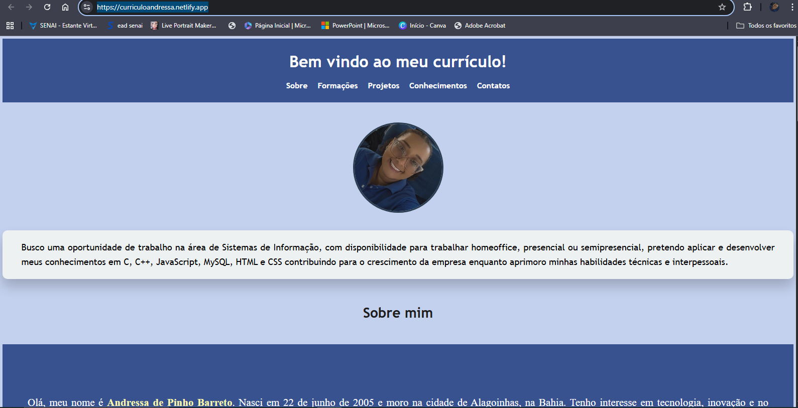

🌐 Meu Currículo Online

Este é o meu site de currículo, desenvolvido utilizando apenas **HTML e CSS**.  
O objetivo deste projeto foi praticar minhas habilidades em desenvolvimento web e criar uma forma interativa e moderna de apresentar minha trajetória profissional.

🚀 Tecnologias Utilizadas
- HTML  
- CSS  

## 🔗 Acesse o site

📸 Prévia do Site

💡 Aprendizados
- Estruturação de páginas com HTML.  
- Estilização e responsividade com CSS.  
- Boas práticas para projetos front-end.  

---

✉️ Se quiser trocar uma ideia ou dar um feedback, será muito bem-vindo(a)!  
